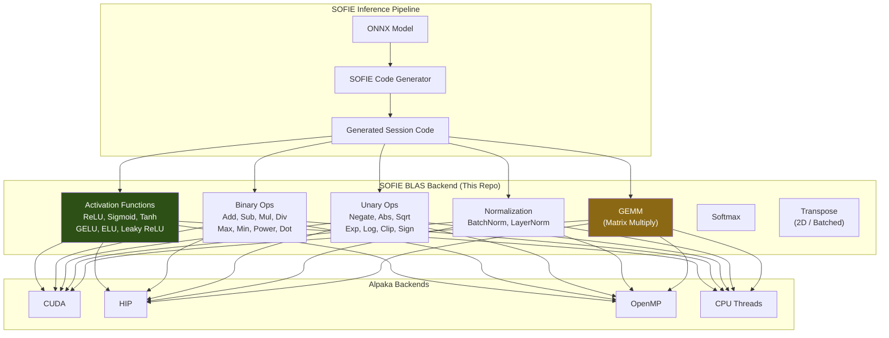

# SOFIE BLAS

Standalone BLAS implementation for [ROOT SOFIE](https://root.cern/doc/master/group__SOFIE.html) (System for Optimized Fast Inference) using [Alpaka](https://github.com/alpaka-group/alpaka) for portable GPU acceleration. Provides activation functions, element-wise operations, normalization layers, and GEMM for neural network inference on heterogeneous hardware.



## Implementation Status

### Activation Functions (GPU Kernels)
- [x] ReLU
- [x] Leaky ReLU
- [ ] PReLU
- [x] Tanh
- [x] ELU
- [x] GELU (tanh approximation)
- [ ] Swish
- [x] Sigmoid
- [ ] SELU

### Binary Operations (Element-wise)
- [ ] Add, Subtract, Multiply, Divide
- [ ] Max, Min, Power
- [ ] Dot Product

### Unary Operations (Element-wise)
- [ ] Negate, Absolute, Square, Sqrt
- [ ] Exp, Log, Clip, Sign

### Normalization Layers
- [ ] Batch Normalization
- [ ] Layer Normalization

### BLAS / Matrix Operations
- [ ] GEMM
- [ ] Softmax
- [ ] Transpose (2D / Batched)

## Quick Start

### Prerequisites

- [Alpaka](https://github.com/alpaka-group/alpaka) installed
- C++17 compiler
- CUDA Toolkit (for GPU backend)

### Usage

The activation functions are implemented as Alpaka kernel functors. Include and use them directly:

```cpp
#include "Activation_Functions.cpp"

// Create the kernel instance
sofie_blas::Activation_Functions kernel;

// Launch with any activation op
alpaka::exec<Acc>(queue, workDiv, kernel,
    input_ptr, output_ptr, num_elements,
    sofie_blas::OpRelu<float>{});

// Or with parameterized ops
alpaka::exec<Acc>(queue, workDiv, kernel,
    input_ptr, output_ptr, num_elements,
    sofie_blas::OpLeakyRelu<float>{0.01f});
```

## Project Structure

```
SOFIE_BLAS/
├── Activation_Functions.cpp   # GPU kernels: ReLU, Sigmoid, Tanh, GELU, ELU, Leaky ReLU
└── README.md
```

## Tech Stack

- **C++17**
- **Alpaka** — Portable parallel kernel abstraction
- **ROOT SOFIE** — ONNX inference code generation
- **CUDA / HIP / OpenMP** — Backend support

## Contributing

1. Fork the repository
2. Implement missing operators from the checklist above
3. Follow the existing functor pattern (`OpName<T>` with `ALPAKA_FN_ACC operator()`)
4. Submit a pull request

## License

This project is available under the MIT License.
